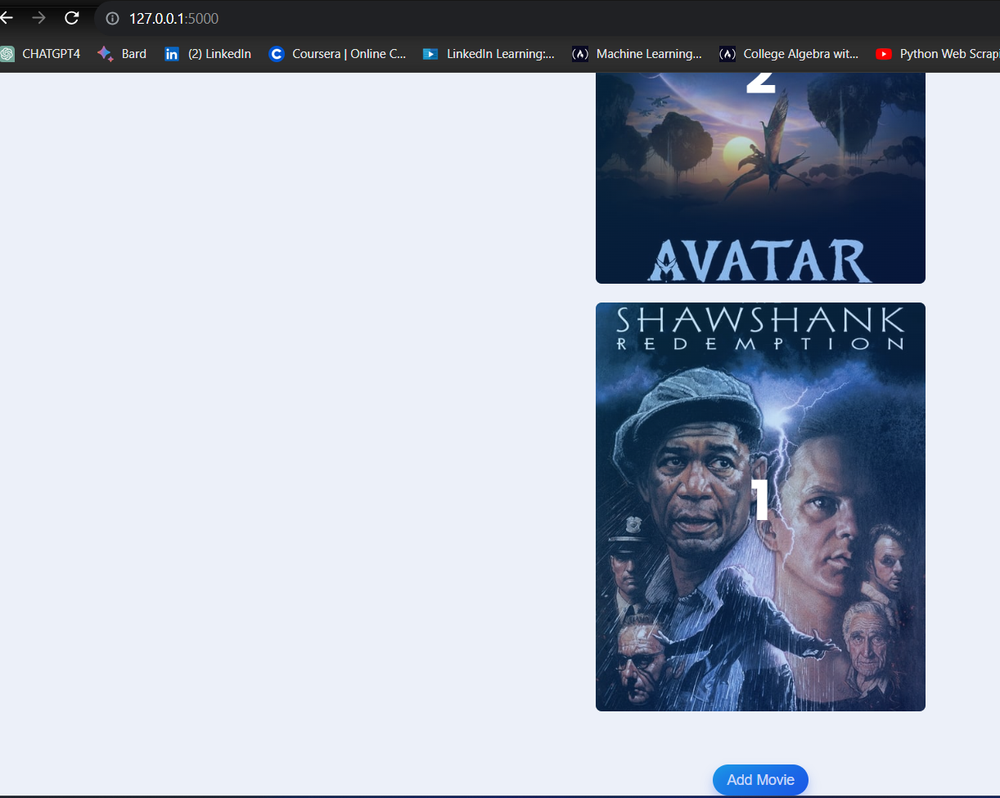

# Flask Movie Manager

Flask Movie Manager is a web application designed for users to effortlessly manage, rate, and review their favorite movies. The application provides an intuitive interface, allowing users to add new movies, rate them, and provide reviews. Powered by Flask and utilizing SQLAlchemy for efficient database management, the app seamlessly integrates with The Movie Database (TMDb) for fetching comprehensive movie details.

## Features

- **Add Movies:** Easily add new movies to your collection.
- **Rate and Review:** Provide ratings and reviews for each movie.
- **Organize Collection:** Explore, rate, and organize your movie collection effortlessly.
- **TMDb Integration:** Fetch detailed movie information from The Movie Database.

## Technologies Used

- Flask
- SQLAlchemy
- Flask-Bootstrap
- Flask-WTF
- The Movie Database (TMDb) API

## Screenshots

